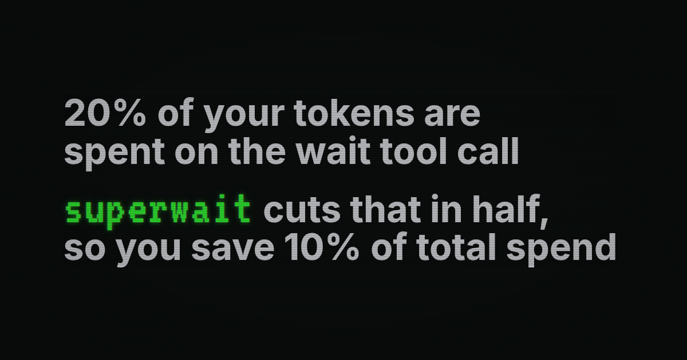

**superwait gives coding agents one place to wait for the outcome they need.** It works with Codex, Claude Code, and Cursor, runs locally, and makes no model calls while checking conditions.

[Install](#install) · [How it works](#how-it-works) · [Host setup](docs/hosts.md) · [Reference](docs/reference.md) · [About the numbers](docs/savings.md)

## Why use superwait?

A build is still running. A reviewer hasn't finished. A service isn't ready yet. Your agent checks, reads “still running,” and calls another wait.

Each trip back to the model can process the conversation again just to decide to keep waiting. With several workers, it also has to track which results arrived, which ones matter, and how much time is left.

superwait lets the agent describe that outcome once:

> Wait for two of the three reviewers. Wake early if the test worker reports a blocker. Stop after 30 minutes.

Local code checks the conditions. The agent gets the completed results and remaining work when there is something to act on. If a blocker interrupts the wait, it can resume with the original deadline intact.

## Install

Requires Python 3.11+ and [uv](https://docs.astral.sh/uv/).

```sh
uv tool install superwait
```

Run **one** setup command from your project:

```sh
superwait setup codex --project .
# Or, for your host:
superwait setup claude --project .
superwait setup cursor --project .
```

Restart your coding agent and review its normal MCP and hook trust prompts. Set up before spawning workers so their lifecycle events can be recorded.

Then ask your agent:

> Use superwait to wait for both reviewers, but return early if either reports a blocker. Stop after 30 minutes.

Setup adds the tool, lifecycle hooks, and instructions that teach your agent how to use them. It preserves unrelated project settings and backs up files it changes. There is no superwait account, API key, or hosted service to configure.

## How it works

1. **Describe the result.** Wait for any, all, or a chosen number of workers and conditions. Add a deadline and anything that should wake the agent early.
2. **Let local code watch.** The wait engine checks conditions concurrently. Hooks record worker events; file, HTTP, and command checks run locally as requested.
3. **Continue with useful results.** The response explains why the wait ended, includes completed reports, and lists what remains pending. A ready-to-use continuation preserves the deadline and remaining count.

The same engine is available as an MCP tool and a CLI. For a long wait that exceeds your host's tool timeout, the agent can use its background terminal.

### What can you wait for?

| You need… | superwait watches… |
| --- | --- |
| Enough reviews to proceed | Any, all, or a quorum of subagents |
| A checkpoint or blocker | An explicit signal from a worker or script |
| An artifact to be ready | A file appearing, changing, disappearing, or containing text |
| A service to come online | An HTTP response with the requested status |
| A custom readiness check | A command returning the requested exit code |

Early-wake conditions can be combined with any of these. A timeout returns the partial results; it does not cancel the workers.

See the [request and result reference](docs/reference.md) for examples, continuation behavior, and CLI usage.

## When does it help most?

Use superwait when an agent keeps checking unchanged state, or when several workers and external conditions need to be coordinated together. A single native wait is often enough for one worker. superwait adds the compound conditions, early wakeups, and shared deadline.

It does not replace your host's built-in wait tools automatically. Your agent needs to use it, and the condition must be observable through a supported hook or check.

## About the numbers

Our corpus study found that wait-only model responses accounted for about **20% of input tokens**. Auditing repeated waits identified roughly half of that input as a consolidation opportunity—about **9–10% of total input**, before replacement overhead.

Actual token and spend savings depend on your corpus, model pricing, caching, and host integration; input-token savings are not the same as measured bill savings. [See the study and how to evaluate your own workload](docs/savings.md).

## Host support and details

Linux and Codex have live integration coverage. Claude Code and Cursor have adapter tests; full live workflows in those hosts, other operating systems, and multi-hour host waits still need qualification.

- [Host setup, permissions, and compatibility](docs/hosts.md)
- [API, CLI, long waits, and local data](docs/reference.md)
- [Contributing](CONTRIBUTING.md) · [PyPI](https://pypi.org/project/superwait/) · [MIT license](LICENSE)
